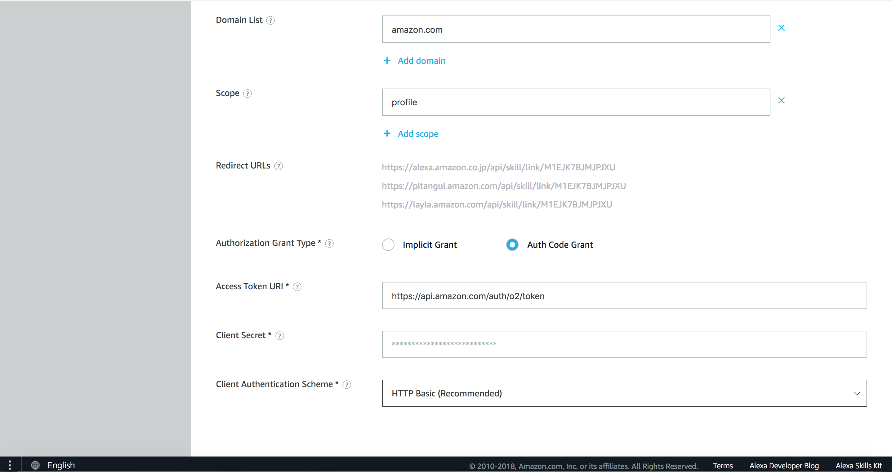
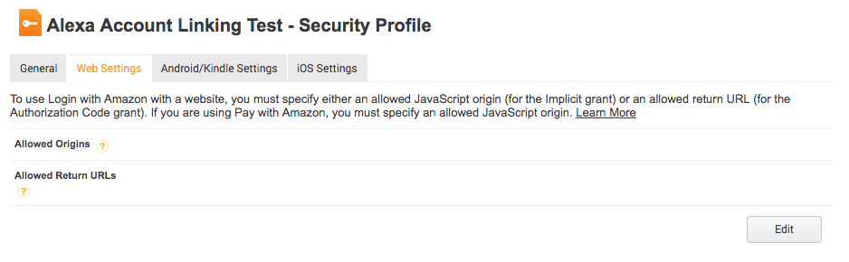
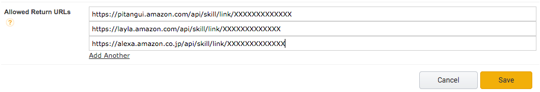
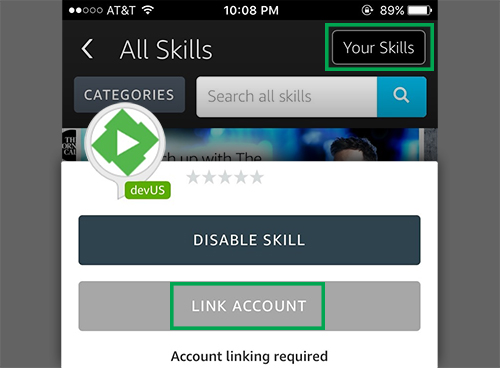
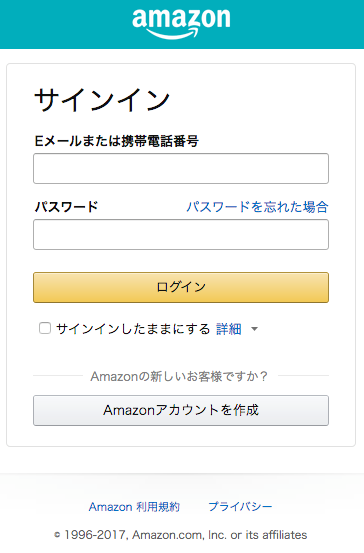
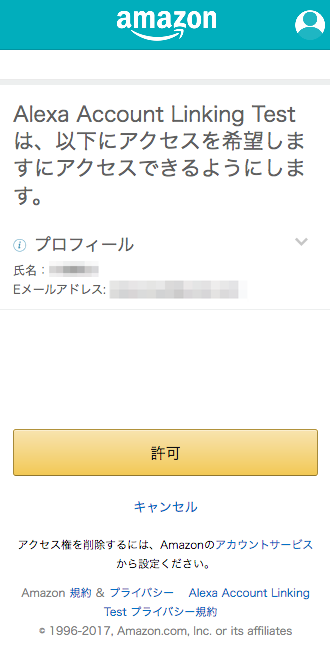
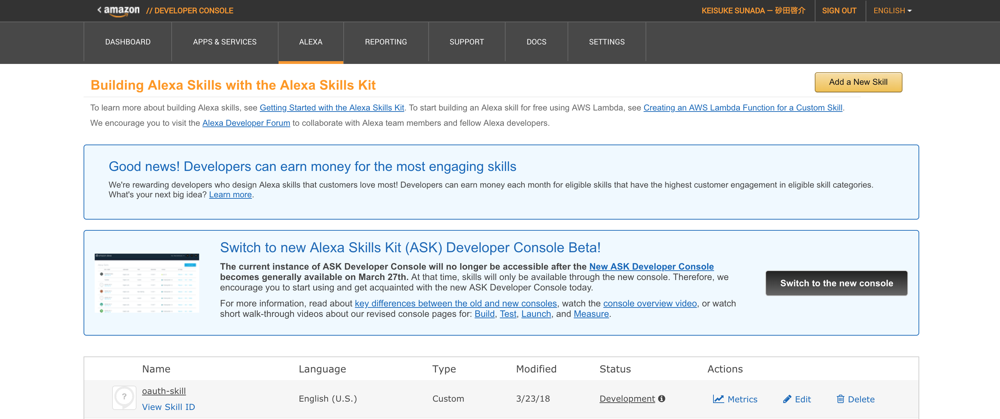
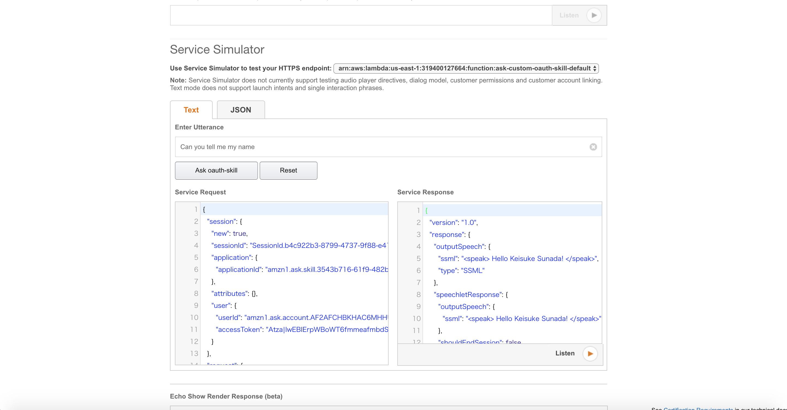

# oauth-skill

This is a skill that shows the name of the Amazon account by using OAuth 2.0.

# Required

- [Amazon Developer Account](https://developer.amazon.com/alexa-skills-kit)
    - For creating Alexa Skill.

- [AWS Account](https://aws.amazon.com/ )
    - For exucuting Lambda function.

# Getting Started

## Set Up Credentials for an Amazon Web Services (AWS) Account

Create a IAM user that has various permissions to complete skill-related tasks. Please see the below link.

- [Set Up Credentials for an Amazon Web Services (AWS) Account](https://developer.amazon.com/ja/docs/smapi/set-up-credentials-for-an-amazon-web-services-account.html)

## Set Up AWS CLI

Set up [AWS CLI](https://docs.aws.amazon.com/ja_jp/streams/latest/dev/kinesis-tutorial-cli-installation.html):

```
$ aws configure
AWS Access Key ID [None]: <IAM_USER_ACCESS_KEY>
AWS Secret Access Key [None]: <IAM_USER_SECRET_ACCESS_KEY>
Default region name [None]: <REGION> // ex:us-west-2
Default output format [None]: json
```

Confirm the credentials of IAM user.

```
$ cat ~/.aws/credentials
[default]
aws_access_key_id = <IAM_USER_ACCESS_KEY>
aws_secret_access_key = <IAM_USER_SECRET_ACCESS_KEY
```

## Install ASK CLI

```
$ npm install -g ask-cli
```

## Initialize ASK CLI

You will be prompted to select your profile and to log in to your developer account. Once the initialization is complete, you can use ASK CLI to manage your skills.

```
$ ask init
```

## Deploy Skill

Clone skill's code from GitHub.

```
$ git clone 
$ cd 
```

Deploy a skill and a Lambda function. Copy ```Skill ID``` shown on console.

```
$ ask deploy
```

## Login with Amazon Settings

You sign in [Amazon Developer Console](https://developer.amazon.com/ja/) and create a new security profile. Created it, ```Client ID``` and ```Client Secret``` are generated. You copy it.

[Create an LWA Security Profile](https://developer.amazon.com/public/ja/solutions/devices/dash-replenishment-service/docs/dash-create-a-security-profile)

## Set Up Account Linking

Run this command, set up account linking of the skill.

```
$ sh account/update_account_linking.sh \
--skill-id <SKILL_ID> \
--auth-url https://www.amazon.com/ap/oa \
--client-id <CLIENT_ID> \
--scope profile \
--domain amazon.com \
--auth-grant-type AUTH_CODE \
--access-token-uri https://api.amazon.com/auth/o2/token \
--client-secret <CLIENT_SECRET> \
--client-auth-schema HTTP_BASIC \
--expiration <EXPIRATION>
```

## Web Settings of LWA Security Profile

Redirect URLs is shown on account linking page of the skill.



You copy it and paste to Allowed Return URLs in LWA Security Profile Web Settings page.





## Install Alexa App

[Goole Play](https://play.google.com/store/apps/details?id=com.amazon.dee.app&hl=ja)

[App Store](https://itunes.apple.com/jp/app/amazon-alexa/id944011620?mt=8)

## Link with Amazon Account

You sign in Alexa App and click the skill you created. Input the Amazon account data and link with Amazon account.







# Test

Access Skills console of old version. Input 'Can you tell me my name' on Service Simulator, the Skill tells your Amazon account name.



